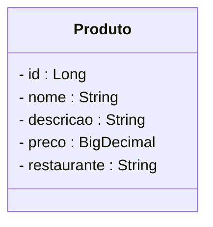
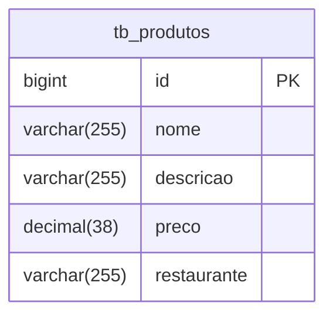

# 🍴 Garfo & Go - Backend

<br />

<div align="center">
    
</div>

<div align="center">


 
</div>

<br /><br />

## 1. 📄 Descrição

Este projeto tem como objetivo implementar um sistema de delivery de alimentos, que permite o gerenciamento de produtos oferecidos por diferentes restaurantes. O sistema será responsável por realizar operações de CRUD (Create, Read, Update, Delete) sobre os produtos cadastrados.

### 1.1. 🛠️ Funcionalidades:

1. Criar Produto (Create): Permite o cadastro de um novo produto no sistema, informando todos os atributos necessários

2. Consultar Produto(s) (Read): Consultar um produto específico através do seu id. Listar todos os produtos cadastrados, com possibilidade de filtragem por nome ou restaurante

3. Atualizar Produto (Update): Permite a modificação dos dados de um produto já existente, identificando-o pelo id

4. Excluir Produto (Delete): Remove um produto do sistema, utilizando seu id como referência

------

## 2. 🖥️ Sobre esta API

A API do Delivery Garfo & Go foi desenvolvida utilizando Java e o framework Spring, seguindo os princípios da Arquitetura MVC e REST. Ela oferece endpoints para o gerenciamento do recurso **Produto**, permitindo a interação entre os usuários com os produtos cadastrados.

### 2.1. 🚀 Principais Funcionalidades

1. Consulta, criação, edição e remoção de produtos

------

## 3. 📊 Diagrama de Classes

O DER (Diagrama Entidade-Relacionamento) do projeto Garfo & Go representa de forma visual como os dados estão organizados no banco de dados relacional e como as entidades se relacionam entre si.



------

## 4. 🗺️ Diagrama Entidade-Relacionamento (DER)




------

## 5. 🧰 Tecnologias utilizadas

| Item                          | Descrição      |
| ----------------------------- | -------------- |
| **Servidor**                  | Tomcat         |
| **Linguagem de programação**  | Java           |
| **Framework**                 | SpringBoot     |
| **ORM**                       | JPA + Hibernate|
| **Banco de dados Relacional** | MySQL          |

------

## 6. ▶️ Configuração e Execução

### 6.1 📦 Importando o Projeto

1. Clone o repositório do Projeto [Garfo & Go](https://github.com/Projetos-Grupo-01/GarfoeGo) dentro da pasta do *Workspace* do STS

```bash
https://github.com/Projetos-Grupo-01/GarfoeGo
```

2. **Abra o STS** e selecione a pasta do *Workspace* onde você clonou o repositório do projeto
3. No menu superior do STS, clique na opção: **File 🡲 Import...**
4. Na janela **Import**, selecione a opção: **General 🡲 Existing Projects into Workspace** e clique no botão **Next**
5. Na janela **Import Projects**, no item **Select root directory**, clique no botão **Browse...** e selecione a pasta do Workspace onde você clonou o repositório do projeto
6. O STS reconhecerá o projeto automaticamente
7. Marque o Projeto Garfo & Go no item **Projects** e clique no botão **Finish** para concluir a importação

<br />

### 6.2. ▶️ Executando o projeto

1. Na Guia **Boot Dashboard**, localize o  **Projeto Garfo & Go**
2. Selecione o **Projeto Garfo & Go**
3. Clique no botão **Start or Restart**  para iniciar a aplicação
4. Caso seja perguntado se você deseja autorizar o acesso ao projeto via rede, clique no botão **Permitir Acesso**
5. Acompanhe a inicialização do projeto no console do STS
6. Verifique se o banco de dados `db_garfogo` foi criado corretamente e se as tabelas foram geradas automaticamente.
7. Utilize o [Insomnia](https://insomnia.rest/) ou o [Postman](https://www.postman.com/) para testar os endpoints.
